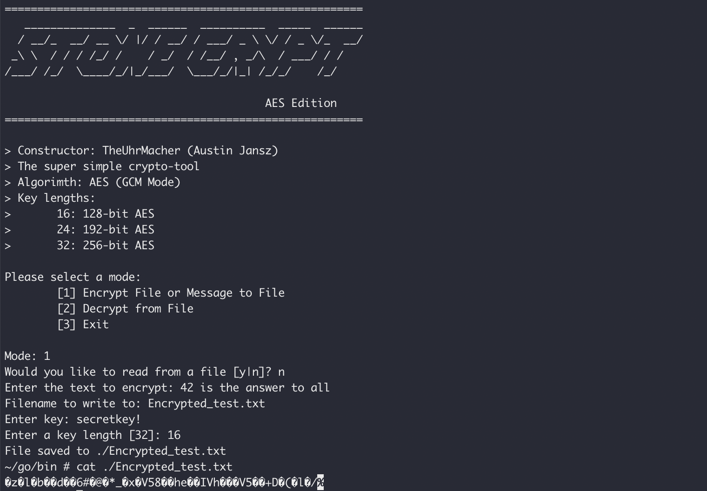
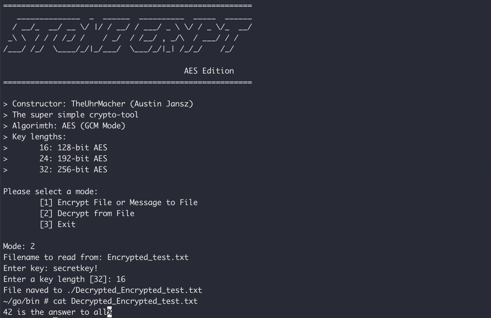

# stone-crypt-aes

*Author: Austin Jansz - DURHAM COLLEGE | UOIT | OntarioTechU*

A modular Go tool to encrypt and decrypt using AES (128, 192, 256 bit).

- Intended Purpose:
    - Allow for the encryption of all the things.

- Notes:
    - Allows for encryption and decryption
      - Encrypt from files or input message
      - Decrypt from files
    - Prompt-based for simple operation
      - Default values:
        - 256-bit AES
        - Encrypt form input message

## Demonstration

### Encryption

### Decryption

